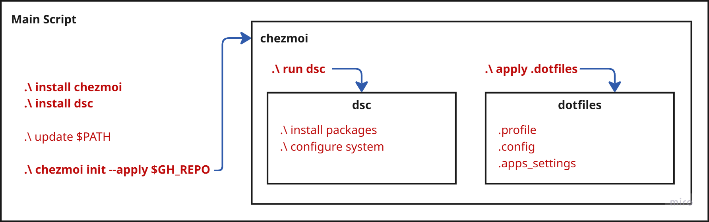

Dotfiles for Windows & Linux
===========================================================

This repository contains dotfiles and automation scripts to deliver a repeatable, cross-platform setup on Windows and
Linux using chezmoi (templated dotfiles) and WinGet DSC (declarative app/module state on Windows). All configuration is
template-driven so the same source adapts per OS and host.

Installation
---------------------------------------------------------------

```powershell
# Windows
iex (irm 'https://getdotfiles.short.gy/install.ps1' | Out-String)
```

```zsh
# Linux / macOS
sh -c "$(curl -fsLS https://getdotfiles.short.gy/install.sh)"
```

General Architecture
---------------------------------------------------------------



## 📦 Installed Applications & Modules

| Name                                                       | Category | Install Type | Purpose                              |
|------------------------------------------------------------|----------|--------------|--------------------------------------|
| PowerShell 7 (Microsoft.PowerShell)                        | shell    | App          | Modern PowerShell shell              |
| Microsoft.WinGet.Client                                    | shell    | Module       | Winget cmdlets for DSC               |
| Starship (Starship.Starship)                               | shell    | App          | Cross-shell prompt                   |
| Windows Terminal (Microsoft.WindowsTerminal)               | shell    | App          | Terminal emulator                    |
| Terminal-Icons                                             | shell    | Module       | File and folder icons in terminal    |
| zoxide (ajeetdsouza.zoxide)                                | shell    | App          | Smart directory navigation           |
| fzf (junegunn.fzf)                                         | fzf      | App          | Fuzzy finder                         |
| fd (sharkdp.fd)                                            | fzf      | App          | Fast file search                     |
| ripgrep (BurntSushi.ripgrep.MSVC)                          | fzf      | App          | Fast text search                     |
| eza (eza-community.eza)                                    | fzf      | App          | Modern ls replacement                |
| bat (sharkdp.bat)                                          | fzf      | App          | Syntax-highlighting cat              |
| file (GnuWin32.File)                                       | fzf      | App          | File type identification             |
| PSfzf                                                      | fzf      | Module       | PowerShell integration for fzf       |
| Git (Git.Git)                                              | git      | App          | Git version control                  |
| onefetch (o2sh.onefetch)                                   | git      | App          | Repo summary in terminal             |
| delta (dandavison.delta)                                   | git      | App          | Syntax-highlighted diffs             |
| less (jftuga.less)                                         | git      | App          | Pager utility                        |
| lazygit (JesseDuffield.lazygit)                            | git      | App          | TUI for Git                          |
| gitql (amrdeveloper.gitql)                                 | git      | App          | Query Git repos with SQL-like syntax |
| posh-git                                                   | git      | Module       | Git prompt enhancements              |
| Microsoft .NET SDK 9 (Microsoft.DotNet.SDK.9)              | dotnet   | App          | .NET 9 SDK                           |
| dotnet-ef (dotnet-ef)                                      | dotnet   | Tool         | EF Core migrations CLI               |
| dotnet-reportgenerator (dotnet-reportgenerator-globaltool) | dotnet   | Tool         | Coverage report generator            |
| dotnet-outdated (dotnet-outdated-tool)                     | dotnet   | Tool         | Check outdated NuGet packages        |
| dotnet-user-secrets (dotnet-user-secrets)                  | dotnet   | Tool         | Manage user secrets                  |
| dotnet-dev-certs (dotnet-dev-certs)                        | dotnet   | Tool         | Manage dev HTTPS certs               |
| gitversion (gitversion.tool)                               | dotnet   | Tool         | Semantic version from git            |
| dotnet-coverage (dotnet-coverage)                          | dotnet   | Tool         | Collect code coverage                |
| dotnet-trace (dotnet-trace)                                | dotnet   | Tool         | Performance tracing                  |
| dotnet-counters (dotnet-counters)                          | dotnet   | Tool         | Monitor performance counters         |
| dotnet-dump (dotnet-dump)                                  | dotnet   | Tool         | Dump process analysis                |
| dotnet-stack (dotnet-stack)                                | dotnet   | Tool         | Managed stack trace tool             |
| Docker Desktop (Docker.DockerDesktop)                      | docker   | App          | Docker engine & UI                   |
| DockerCompletion                                           | docker   | Module       | Docker command completion            |
| chezmoi (twpayne.chezmoi)                                  | chezmoi  | App          | Templated dotfiles manager           |
| Visual Studio Code (Microsoft.VisualStudioCode)            | editors  | App          | Code editor                          |
| JetBrains Rider (JetBrains.Rider)                          | editors  | App          | .NET IDE                             |
| Google Chrome (Google.Chrome)                              | browsers | App          | Web browser                          |
| PowerToys (Microsoft.PowerToys)                            | other    | App          | Power utilities for Windows          |
| yazi (sxyazi.yazi)                                         | other    | App          | TUI file manager                     |
| powershell-yaml                                            | other    | Module       | YAML parsing for PowerShell          |
| Pester                                                     | other    | Module       | PowerShell testing framework         |

---

See key bindings and shortcuts here: [docs/bindings.md](docs/bindings.md)
