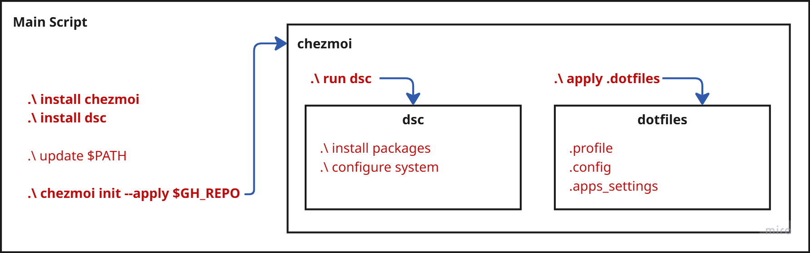

Dotfiles for Windows & Linux
===========================================================

This repository contains dotfiles and automation scripts to deliver a repeatable, cross-platform setup on Windows and
Linux using chezmoi (templated dotfiles) and WinGet DSC (declarative app/module state on Windows). All configuration is
template-driven so the same source adapts per OS and host.

Installation
---------------------------------------------------------------

```powershell
# Windows
iex (irm 'https://getdotfiles.short.gy/install.ps1' | Out-String)
```

Linux / macOS: there is no installer script yet (tracked in [#12](https://github.com/Ermesx/dotfiles/issues/12)).
Install [chezmoi](https://www.chezmoi.io/install/) manually and run `chezmoi init --apply Ermesx`; only part of the
configuration applies there.

General Architecture
---------------------------------------------------------------



Daily use
---------------------------------------------------------------

Everything is managed by chezmoi with this repo as the source (`home/`). Change the source, not the files in `$HOME`.
Rationale: [ADR-0002](docs/adr/0002-chezmoi-as-dotfiles-manager.md); source layout and attributes:
[docs/chezmoi.md](docs/chezmoi.md).

| Goal | Command |
|---|---|
| Get changes from the repo | `chezmoi update` (git pull + apply) |
| Preview before applying | `chezmoi status`, `chezmoi diff` |
| Change a config | `chezmoi edit <target>` (opens VS Code), then `chezmoi apply` |
| Pick up a file edited in `$HOME` | `chezmoi re-add` (all tracked) or `chezmoi add <target>` (new file) |
| Add a secret | `chezmoi add --encrypt <target>` |
| Resolve drift or a conflict | `chezmoi merge <target>` |
| Commit and publish | `chezmoi cd`, then `git commit` / `git push` on a branch off `develop` |
| Upgrade apps and modules | `Check-Updates`, `Update-Apps`, `Update-Modules` (PowerShell profile) |

Things that bite:

- `chezmoi diff` excludes scripts (`[diff] exclude = ["scripts"]`), but `chezmoi apply` and `update` still run them.
  `run_onchange_` scripts (the DSC run among them) rerun only when their rendered input changed, for example after a
  `packages.yaml` edit, and they install software.
- `chezmoi re-add` does not update `.tmpl` sources: it skips templates. Change those in the source with
  `chezmoi edit`.
- `chezmoi update` aligns the declared state only. It does not upgrade installed apps or modules; use the update
  commands above (limited to the packages in `packages.yaml`).
- `git.autoCommit` / `git.autoPush` are deliberately off: changes go through a branch off `develop` and Conventional
  Commits, which auto-commit on the current branch would bypass.

## 📦 Installed Applications & Modules

<!-- BEGIN:packages -->
| Name                                                       | Category   | Install Type | Purpose                              |
|------------------------------------------------------------|------------|--------------|--------------------------------------|
| PowerShell 7 (Microsoft.PowerShell)                        | shell      | App          | Modern PowerShell shell              |
| Starship (Starship.Starship)                               | shell      | App          | Cross-shell prompt                   |
| Windows Terminal (Microsoft.WindowsTerminal)               | shell      | App          | Terminal emulator                    |
| jq (jqlang.jq)                                             | shell      | App          | JSON processor                       |
| zoxide (ajeetdsouza.zoxide)                                | shell      | App          | Smart directory navigation           |
| yazi (sxyazi.yazi)                                         | shell      | App          | TUI file manager                     |
| AIChat (sigoden.AIChat)                                    | shell      | App          | LLM chat CLI                         |
| Microsoft.WinGet.Client                                    | shell      | Module       | Winget cmdlets for DSC               |
| Terminal-Icons                                             | shell      | Module       | File and folder icons in terminal    |
| yazi-rs/plugins:full-border                                | shell      | Yazi plugin  | Full border for yazi panes           |
| fzf (junegunn.fzf)                                         | fzf        | App          | Fuzzy finder                         |
| fd (sharkdp.fd)                                            | fzf        | App          | Fast file search                     |
| ripgrep (BurntSushi.ripgrep.MSVC)                          | fzf        | App          | Fast text search                     |
| eza (eza-community.eza)                                    | fzf        | App          | Modern ls replacement                |
| bat (sharkdp.bat)                                          | fzf        | App          | Syntax-highlighting cat              |
| PSfzf                                                      | fzf        | Module       | PowerShell integration for fzf       |
| Git (Git.Git)                                              | git        | App          | Git version control                  |
| onefetch (o2sh.onefetch)                                   | git        | App          | Repo summary in terminal             |
| delta (dandavison.delta)                                   | git        | App          | Syntax-highlighted diffs             |
| less (jftuga.less)                                         | git        | App          | Pager utility                        |
| lazygit (JesseDuffield.lazygit)                            | git        | App          | TUI for Git                          |
| gitql (amrdeveloper.gitql)                                 | git        | App          | Query Git repos with SQL-like syntax |
| GitHub CLI (GitHub.cli)                                    | git        | App          | GitHub from the terminal             |
| posh-git                                                   | git        | Module       | Git prompt enhancements              |
| Microsoft .NET SDK 10 (Microsoft.DotNet.SDK.10)            | dotnet     | App          | .NET 10 SDK                          |
| dotnet-ef (dotnet-ef)                                      | dotnet     | Tool         | EF Core migrations CLI               |
| dotnet-reportgenerator (dotnet-reportgenerator-globaltool) | dotnet     | Tool         | Coverage report generator            |
| dotnet-outdated (dotnet-outdated-tool)                     | dotnet     | Tool         | Check outdated NuGet packages        |
| dotnet-user-secrets (dotnet-user-secrets)                  | dotnet     | Tool         | Manage user secrets                  |
| dotnet-dev-certs (dotnet-dev-certs)                        | dotnet     | Tool         | Manage dev HTTPS certs               |
| gitversion (gitversion.tool)                               | dotnet     | Tool         | Semantic version from git            |
| dotnet-coverage (dotnet-coverage)                          | dotnet     | Tool         | Collect code coverage                |
| dotnet-trace (dotnet-trace)                                | dotnet     | Tool         | Performance tracing                  |
| dotnet-counters (dotnet-counters)                          | dotnet     | Tool         | Monitor performance counters         |
| dotnet-dump (dotnet-dump)                                  | dotnet     | Tool         | Dump process analysis                |
| dotnet-stack (dotnet-stack)                                | dotnet     | Tool         | Managed stack trace tool             |
| refitter                                                   | dotnet     | Tool         | Refit client generator from OpenAPI  |
| Node.js (OpenJS.NodeJS)                                    | node       | App          | JavaScript runtime                   |
| Docker Desktop (Docker.DockerDesktop)                      | containers | App          | Docker engine & UI                   |
| Vagrant (Hashicorp.Vagrant)                                | containers | App          | VM environments for testing          |
| DockerCompletion                                           | containers | Module       | Docker command completion            |
| chezmoi (twpayne.chezmoi)                                  | chezmoi    | App          | Templated dotfiles manager           |
| Visual Studio Code (Microsoft.VisualStudioCode)            | editors    | App          | Code editor                          |
| JetBrains Rider (JetBrains.Rider)                          | editors    | App          | .NET IDE                             |
| Google Chrome (Google.Chrome)                              | browsers   | App          | Web browser                          |
| PowerToys (Microsoft.PowerToys)                            | other      | App          | Power utilities for Windows          |
| Scalar (APIDocumentation.Scalar)                           | other      | App          | API client and docs                  |
| powershell-yaml                                            | other      | Module       | YAML parsing for PowerShell          |
| Pester                                                     | other      | Module       | PowerShell testing framework         |
| Ubuntu-24.04                                               | other      | WSL distro   | Linux distro for WSL                 |
<!-- END:packages -->

---

See key bindings and shortcuts here: [docs/terminal-bindings.md](docs/terminal-bindings.md)
